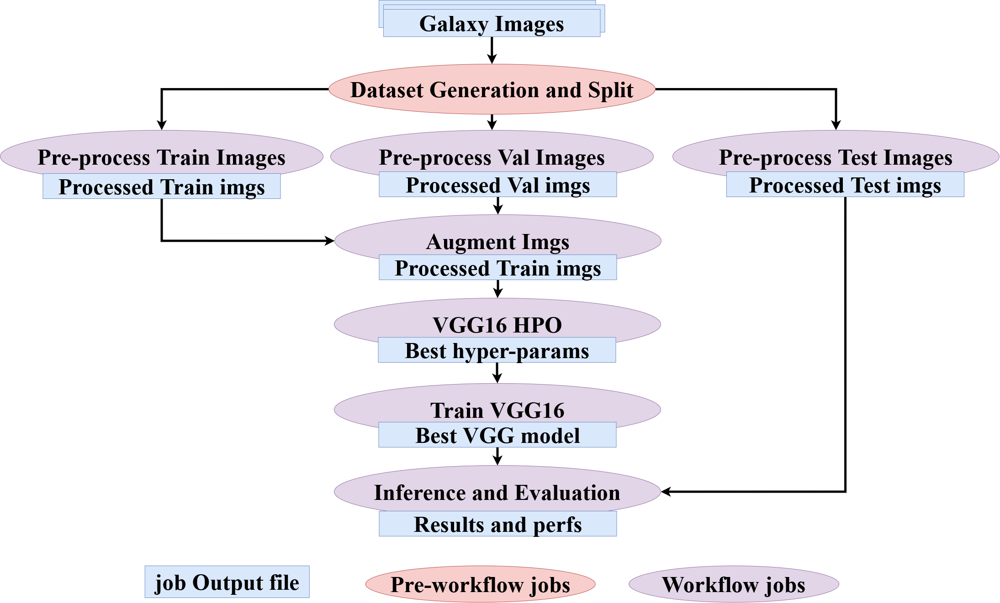
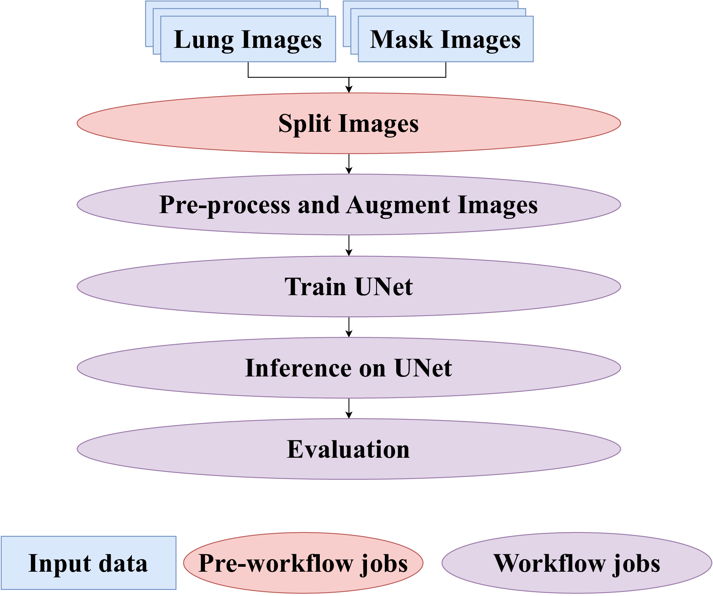

Examples
===================

.. warning::

   All the workflow examples provided are for demonstration purposes only. 
   In order to run them, it is necessary to have an execution environment 
   set up, preferably with updated parameters such as file paths and scripts.
   The full project, including execution files, is provided in the Git repository.

.. note::

   The notebook is provided for generating workflows. 
   You can create a copy and change the ``tracker_type`` parameter 
   and update the metadata tracking information to explore tracking options and configurations.

Galaxy Classification Workflow
---------------------------------

Context
~~~~~~~~~~~~~~~~
Scientists use astronomical data from large-scale surveys such as the Sloan Digital Sky Survey (SDSS) to, among other tasks, map astronomical objects and study their evolution. The galaxy morphology classification is a critical step towards understanding how galaxies form and evolve. Due to massive amounts of data currently available, researchers aim to develop robust deep learning models to automatically classify images of the galaxies into 1 of 5 categories: completely round-smooth, in-between smooth, cigar-shaped smooth, edge-on, and spiral. The implementation of this workflow is based on a publication [9] and is publicly available [10].

Workflow Overview
~~~~~~~~~~~~~~~~~~~~~~~~~~~~~~~~
The Galaxy Classification Workflow (Figure 1) utilizes the Galaxy Zoo 2 dataset that consists of 61,578 RGB images, each of size 424x424x3 pixels (1.9 GB of compressed data). The first stage of the workflow (Dataset Generation and Split) filters out galaxies based on their feature scores. This reduced dataset of 28,790 images is split into training, validation, and test sets. These datasets are passed to Pre-process Images jobs where several data transformations (e.g., crop, downscale, whitening) are applied. To address the problem of class imbalance in the dataset, Augment Images jobs generate additional instances of underrepresented galaxy types. Next, the VGG16 HPO job utilizes the Optuna [11], an HPO framework, to find a good set of hyperparameters (e.g., learning rate, numbers of transferred layers). The chosen hyperparameters and all the data are sent to the Train VGG16 job where the model is trained with the chosen hyperparameters. The weights of the trained model are saved to a checkpoint file. Finally, the Inference and Evaluation job runs predictions on the test set, generates statistics and plots that provide insights into the quality of the trained model.

   
   Galaxy Classification Workflow

.. raw:: html

   

       <a href="https://colab.research.google.com/drive/1CNgn0LRvZCfRBmstT-TxpqslgtEWSMIc?usp=sharing" class="btn" style="background-color:#2980B9; color:white; border-radius:5px; padding:10px 20px; text-decoration:none; display:flex; align-items:center; margin-right: 10px;" target="_blank">
           
           Open in Google Colab
       </a>

       <a href="https://github.com/pegasus-isi/galaxy-classification-workflow" class="btn" style="background-color:#2980B9; color:white; border-radius:5px; padding:10px 20px; text-decoration:none; display:flex; align-items:center; margin-left: 10px;" target="_blank">
           
           View on GitHub
       </a>

   

Lung Segmentation Workflow
------------------------------

Context
~~~~~~~~~~~~~~~~~~~~~~~~~~~~~~~~

Precise detection of the borders of organs and lesions in medical images such as X-rays, CT, or MRI scans is an essential step towards correct diagnosis and treatment planning. We implement a workflow that employs supervised learning techniques to locate lungs on X-ray images. The implementation is publicly available [12].

Workflow Overview
~~~~~~~~~~~~~~~~~~~~~~~~~~~~~~~~

The Lung Segmentation Workflow  uses the Chest X-ray Masks and Labels dataset (800 high-resolution X-ray images and masks, 5.4 GB) available on Kaggle. The dataset is split into training, validation, and test sets before the workflow starts. Each set consists of original lung images (3000x2933 pixels each, 6.3 MB in size) and their associated masks (same resolution, 30 KB in size). The Pre-process and Augment Images job resizes images (lungs and masks) to 256x256 pixels and normalizes lung X-rays. Additionally, for each pair of lung image and mask in the train dataset, two new pairs are generated through image augmentation (e.g., rotations, flips). Next, the train and validation data are passed to the UNet HPO job, where Optuna [11] explores different learning rates. The Train UNet job fine-tunes the UNet model with the recommended learning rate on the concatenated train and validation set, and saves the weights into a file. The Inference on UNet job uses the trained model to generate masks for the test X-ray images. The final step of the workflow, the Evaluation job, generates a PDF file with the scores for relevant performance metrics and prints examples of lung segmentation images produced by the model. As the inference and evaluation steps are implemented as separated jobs, the Inference on UNet job can be deployed independently for real-world predictions.

   
   Lung Segmentation Workflow

.. raw:: html

   

       <a href="https://colab.research.google.com/drive/1Wg_gEb2l_Ccr-O5oVORusa7gtM0spajM?usp=sharing" class="btn" style="background-color:#2980B9; color:white; border-radius:5px; padding:10px 20px; text-decoration:none; display:flex; align-items:center; margin-right: 10px;" target="_blank">
           
           Open in Google Colab
       </a>

       <a href="https://github.com/pegasus-isi/lung-instance-segmentation-workflow" class="btn" style="background-color:#2980B9; color:white; border-radius:5px; padding:10px 20px; text-decoration:none; display:flex; align-items:center; margin-left: 10px;" target="_blank">
           
           View on GitHub
       </a>

   

Federated learning Workflow
----------------------------------

Context
~~~~~~~~~~~~~~~~~~~~~~~~~~~~~~~~
Federated Learning (FL), introduced by Google in 2017 [1], is a method addressing privacy concerns by enabling local training on individual devices or servers. Each device or server computes model updates using its local data, which are then aggregated centrally to update the global model. This iterative process enhances edge computing capabilities while ensuring data privacy and security.
[1] McMahan, H. Brendan, et al. "Communication-efficient learning of deep networks from decentralized data." Artificial Intelligence and Statistics. PMLR, 2017.

Workflow Overview
~~~~~~~~~~~~~~~~~~~~~~~~~~~~~~~~

This implementation of federated learning as a use case due to the complexity associated with managing distributed rounds and handling a large number of participants in FL training or evaluations. Providing an overview of all user performance during training or evaluation can be challenging, as is identifying the data used in each round, representing a challenging task for any individual.

The implementation of one round of Federated Learning (FL), covering the entire FL workflow from model initialization to global performance evaluation. Initially, an initial model is created using the init_model job, followed by the concurrent selection of 3 clients for local training. These clients utilize the initial model and input data to train local models, facilitated by the local training client * job. Subsequently, the local models are aggregated into a single global model using the Global model Aggregation job. The global model is then evaluated by a selected set of clients, chosen using a random selection approach in this implementation. The Model evaluation client * job generates local evaluation files per client, which are used by the Perf_evaluation jobs to generate a global evaluation of the model. This evaluation is based on a predefined logic, such as the average of metrics from local evaluations.

.. figure:: img/flWF.png
   
   One round Federated learning Workflow

.. raw:: html

   

       <a href="https://colab.research.google.com/drive/1eD3r1Yb9KIImww_gqFrmzHJqqmw3ZNOQ?usp=sharing" class="btn" style="background-color:#2980B9; color:white; border-radius:5px; padding:10px 20px; text-decoration:none; display:flex; align-items:center; margin-right: 10px;" target="_blank">
           
           Open in Google Colab
       </a>

       <a href="https://github.com/pegasus-isi/federated-learning-example/" class="btn" style="background-color:#2980B9; color:white; border-radius:5px; padding:10px 20px; text-decoration:none; display:flex; align-items:center; margin-left: 10px;" target="_blank">
           
           View on GitHub
       </a>

   

